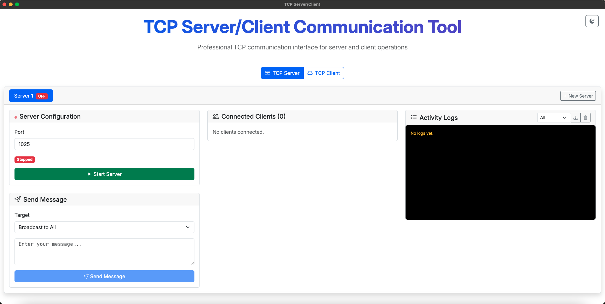
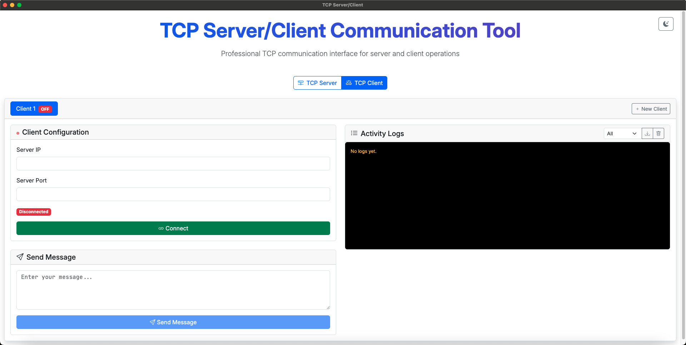

# TCP Server/Client Communication Tool


## Overview

**TCP Server/Client Communication Tool** is a professional interface for managing TCP server and client communication. Designed for network developers, testers, and students, this app provides an intuitive way to set up TCP servers and clients, view connected clients, send messages, and monitor real-time activity logs.

## Features

- **Easy Server/Client Switching**: Instantly toggle between TCP Server and TCP Client modes.
- **Server Management**: Start/stop TCP servers, configure ports, and monitor connected clients from a clean dashboard.
- **Client Configuration**: Connect to remote TCP servers by specifying IP and port, and send custom messages.
- **Real-Time Activity Logs**: View all incoming and outgoing messages, connection statuses, and events.
- **Broadcast & Targeted Messaging**: Send messages to all connected clients or select a specific target.
- **Modern UI**: Built with TypeScript, HTML, and CSS for a responsive and user-friendly experience.

## Screenshots

### Server Mode


### Client Mode


## Getting Started

### Prerequisites

- Node.js (v14 or above recommended)
- npm or yarn

### Installation

1. Clone the repository:
   ```bash
   git clone https://github.com/RajHirani/tcp-server-client.git
   cd tcp-server-client
   ```
2. Install dependencies:
   ```bash
   npm install
   # or
   yarn install
   ```
3. Start the application:
   ```bash
   npm run dev
   # or
   yarn run dev
   ```

### Usage

- Select **TCP Server** or **TCP Client** mode.
- In Server mode, configure the port and start the server. Connected clients will be listed.
- In Client mode, provide the server’s IP and port, then connect.
- Use the message panel to send and receive messages.
- Monitor activities and connection logs in real time.

## Technologies Used

- **TypeScript**
- **HTML/CSS**
- **JavaScript**

## License

This project is not licensed yet.

---

> **Developed by [RajHirani](https://github.com/RajHirani)**